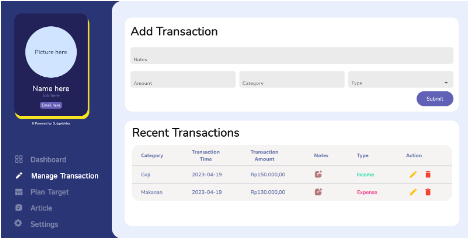

# BudgetWise Financial Management Application

## Deskripsi Aplikasi
Untuk membantu orang-orang, khususnya masyarakat Indonesia dalam mengatur keuangannya, dikembangkan sebuah P/L yang dapat mencatat pengeluaran dan/atau pemasukan pengguna secara akurat dan membantu dalam membuat perencanaan keuangan. Perangkat lunak yang dikembangkan adalah BudgetWise, sebuah perangkat lunak berbasis desktop yang menggunakan bahasa python dan library flet.

BudgetWise menyediakan beberapa fitur yang dapat membantu orang-orang dalam mengatur keuangannya. Beberapa fitur yang disediakan BudgetWise antara lain adalah fitur untuk menyimpan, memasukkan, menghapus, mengedit, dan mengelompokkan  data pemasukan/pengeluaran keuangan. Selain itu, ada fitur untuk menampilkan artikel atau video yang berkaitan dengan tips-tips untuk mengatur keuangan. BudgetWise juga dapat menampilkan keseluruhan data keuangan yang sudah dikelompokkan, baik dalam bentuk tabel, maupun grafik. 

## Cara Menjalankan Aplikasi

Aplikasi dapat dijalankan dengan melakukan langkah - langkah berikut ini : 
1. Clone repository ini 
```sh
$git clone https://gitlab.informatika.org/rpl1_k1_g10/if2250-2023-k01-g10-budgetwise.git
```
2. Masuk ke dalam folder hasil clone

```sh
$ cd if2250-2023-k01-g10-budgetwise
```

3. Download package yang dibutuhkan
```sh
$ pip install -r requirements.txt
```

4. Program sudah bisa dijalankan dengan command 
```sh
$ python -m src.main
```

## Modul dan Pembagian Tugas
- Modul mengolah transaksi (Melihat, Menambah, Mengubah, Menghapus)
<br>
<br>
<br>
<br>
- Modul Mengelola Target (Melihat, Menambah, Mengubah, Menghapus)
<br>
<br>
<br>
<br>
- Modul melihat artikel 
<br>
- Modul mengelompokkan data berdasarkan kategori
<br>
<br>
- Modul memperbaharui saldo 
<br>


Pembagian Tugas
| NIM | Nama | Tugas |
|-------|--------|-------|
| 13521079 | Hobert Anthony Jonathan | Artikel |
| 13521083 | Moch. Sofyan Firdaus | Dashboard Page, Target Page, Settings Page, Controller|
| 13521111 | Tabitha Permalla | Target Page, Settings Page, Input Validation |
| 13521135 | Nicholas Liem | Databases, DatabaseManager |
| 13521139 | Nathania Calista Djunaedi | Dashboard Page, Manage Transaction |


## Daftar Tabel Basis Data
Tabel Pemasukan<br>
Atribut-atribut pada Tabel Pemasukan adalah sebagai berikut:
- Id_pemasukan dengan tipe data integer
- Nominal dengan tipe data integer
- Tanggal dengan tipe data date
- Kategori dengan tipe data string
- Catatan dengan tipe data string

Tabel Pengeluaran <br>
Atribut-atribut pada Tabel Pengeluaran adalah sebagai berikut:
- Id_pengeluaran dengan tipe data integer
- Nominal dengan tipe data integer
- Tanggal dengan tipe data date
- Kategori dengan tipe data string
- Catatan dengan tipe data string

Tabel Transaksi<br>
- Atribut-atribut pada Tabel Target adalah sebagai berikut:
- Id_transaksi dengan tipe data integer
- Tipe_transaksi dengan tipe data string
- Id_sumber dengan tipe data integer references id_pengeluaran atau id_pemasukan

Tabel Target<br>
Atribut-atribut pada Tabel Target adalah sebagai berikut:
- Id_target dengan tipe data integer
- Judul dengan tipe data string
- Nominal_target dengan tipe data integer
- Catatan dengan tipe data string
- Tanggal_dibuat dengan tipe data date
- Tanggal_tercapai dengan tipe data date